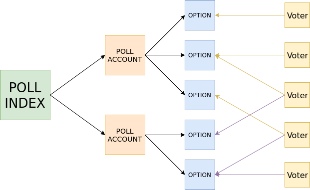

# NEM Voting Standard

## Table of contents

1. [Introduction](#introduction)
2. [General Structure](#structure)
3. [Voting](#voting)
4. [Counting Votes](#counting)
5. [Scalability](#scalability)
6. [Old Poll Structure](#old)
7. [Future](#future)
8. [Reference Implementation](#code)

## Introduction <a name="introduction"></a>

The NEM voting standard allows anybody to create a poll on the NEM blockchain for other people to vote on. Poll creation and voting is implemented on NanoWallet, and results can be seen both in NanoWallet and some NEM block explorers.

The system leverages the already existing importance score from every account to weigh votes.

There is also the possibility of creating a poll with a whitelist where all casted votes weigh equally, and in the future if the NIS allows for it, a mosaic vote is going to be implemented where votes count proportional to the amount of a certain mosaic held by the voter.

In this document we describe the the technical details of the standard that everyone should use for creating, voting and counting polls, so that everybody gets the same results.

## General structure <a name="structure"></a>

The voting structure consists of a series of NEM accounts and messages sent to them as a way of storing immutable information on the blockchain.

A poll is formed by (n + 1) accounts, where n is the number of options for the poll. These accounts are:
- The Poll Account (PA): The poll account is the main account for a poll. It contains all the info for a poll in various messages (described below)m such as the title, the description, the option addresses, etc.
- The Option Accounts(OA): Each poll has an option account for every possible option to vote on. Option accounts are empty and they contain no messages. The poll account contains all the addresses to the corresponding option accounts.

To vote on a poll a voter must send a transaction with 0 xem to the option account they wish to vote for, this must be done before the end of the poll, and the weight of their vote will be equal to the importance score from their account at the last harvested block before the poll ends.

With the two types of account described we can create a well formed poll and vote on it. If we input the poll address on the NanoWallet voting module manually we can count the votes and see all the information. But the poll will not appear in the initial menu in NanoWallet, nor in the Block explorers, since it is not on the public poll index. This is ok if you want to host a private poll, but as we will see there is a better way of doing it with private poll indexes.

Poll Indexes contain a list of Polls in the form of messages, that we will call poll headers. Poll headers contain basic info for a poll, like the title, the type of vote counting, and most importantly the poll accoiunt's address. This is sent to a poll index account at the time of the poll creation so that the poll is easily found and tracked. A public poll index account exists for general purpose public polls, but poll indexes can be created by users, both public and private (which creates a poll index where only the creator can submit polls).

The final poll structure would look something like this:



Where boxes represent accounts, black arrows represent address pointers and colored arrows represent vote messages.

## Poll Creation <a name="creation"></a>

We are going to generate some accounts to create a poll. This accounts should not be owned by anybody, they are just used to store information, so when we crete a new account, we don't need to save the private key for it, it will just be discarded.

The information sent to the accounts is encoded as plain strings or JSON depending on the type of data. The messages are sent as unquoted strings.

Let's walk through the steps to create a poll:

### 0. Poll Index (optional)
First of all if you intend to publish your poll to a personal index, you should create it first.
Generate a new account and save the address.
The address is sent as a message to the poll index creator by himself, so that there will be a way to list all indexes created by an account. This mesage has the structure:

`createdPollIndex:TATWKUGFW5RABZZGHP3AXMISRHTTCZI643VFMA62`

where TAT...A62 is the poll index address.

Then we send a message to the poll index account to declare it as a poll index and to configure it as public or private. With structure:

`pollIndex:{"private":false}`

where the private field can be "true" or "false".

### 1. Generate Accounts
We need to generate one Poll Account and one account for every option, in no particular order, then save all the generated addresses. Address generation can take a little bit of time, this is why you have to wait when creating a poll.

### 2. Send Information to Accounts
Now all the accounts we need have been created, now we need to populate them with information, in the form of messages. We will first send the poll information to the Poll Account.

The messages in a NEM transaction have a length limit, which limits the details you can add to a single message, because of this we will split the information in different messages to optimize the quantity of information sent, while minimizing the fee cost of a poll creation.

Three messages are sent to the Poll Account for a regular poll:

1. **formData:**

This message contains the data that defines the poll parameters. An example message is:

`formData:{"title":"title","doe":1607772120000,"multiple":false,"type":0}`

where:
- title: The title of the poll.
- doe: Time of the poll ending when the votes will be definitive (in milliseconds since thursday, 1 January 1970)
- multiple: true or false. If set to true people is allowed to split their importance between different options.
- type: the counting type of polls:
    - 0 -> POI
    - 1 -> whitelist
    - 2 -> mosaic (not implemented)

2. **description:**

This message contains only the description of the poll, which we want to be able to be as long as possible:

`description:this is the description`

3. **options:**

This message contains the poll's options and their respective option account addresses. It consists of an array of the option strings and a dictionary that maps the option strings to their respective option account.

The string array is redundant and could be removed to save space but it was left in there for compatibility with the old poll structure (explained below). You can add quite a lot of options before you surpass the message limit, so this is not a critical problem. The format is this:

`options:{"strings":["yes","no"],"link":{"yes":"TC2BOQO2JVBZMVSFTUILCSQBGOUAZIOCZXTHAP6S","no":"TCKMEQVM32F7BL6IHU2QF4S6JJVXIMDFXN6PXBN6"}}`

the strings parameter contains an array of the option strings. The link parameter is a map from strings to their respective option addresses.

4. **whitelist (only for whitelist polls):**

The whitelist message contains a whitelist with people who is allowed to vote. This is very limited by the message length and right now does not have very practical uses. The better option would be to distribute a mosaic for everyone you want to be allowed to vote and then create a mosaic poll. But as of the current NIS api there is no historical information on mosaics, so the mosaic vote counting can't be properly implemented in a decentralized way.

`whitelist:["TCCXQPJNPXAZFKV2IZHIFLAGTSN42WPNAQI6XGK3"]`

the message contains an array with the whitelisted addresses.

5. **Poll Header:**

Once the poll has been created and there have been no errors we can add it to a poll index for discoverability. For this purpose we create a poll header with basic data for the poll and send it to a poll index account.

The message looks like this:

`poll:{"title":"title","type":0,"doe":1607772120000,"address":"TBR6KPJ2PMUXVWIDLYAUAY52XBU7KDOVTWYLBTUN"}`

all of the data here is redundant and is already stored in the poll account, but it is replicated here for easy loading of basic information without having to query the poll account.

Now the poll is formed and ready for voting after all the transactions have been confirmed.

## Voting <a name="voting"></a>

A vote from a simple account consists of a transaction with 0xem and 0 mosaics to the desired option account. It is important that there is no xem or mosaics included, or it will not be counted. A message can be added, but it is not added when voting from NanoWallet.

Voting from a multisig account is also a transaction with 0xem and 0 mosaics, but it includes a message by default, which tells cosigners what poll and option this transaction is for. The message in NanoWallet looks like this:

`vote for poll TBR6KPJ2PMUXVWIDLYAUAY52XBU7KDOVTWYLBTUN with option "yes"`

but the format is not important, since the message is just informative for cosigners, and is ignored by the system. Nothing stops a multisig cosigner from creating a manual vote with a misleading message, but when you have a multisig account with somebody a certain amount of trust is expected.

## Vote counting <a name="counting"></a>

The result of a poll is not stored anywhere, since that would mean you have to trust the server storing it to have calculated the results correctly. To guarantee decentralization the results can be calculated by anybody anytime. The client asks the NIS for the poll information and for all of the transactions sent to the option accounts. If everybody uses the same protocol for counting votes then they get the same result.

We will describe now the description for the correct protocol implemented in NanoWallet, that should be used by everybody in order to get the correct results. Example code will also be provided in this repo.

1. **Get the poll information**

First query the api for the first messages on the poll account that start with "options:" and "formData:". It is important that the first ones are used, since anybody can send a new message to the poll account. From the options message we get all the option account's addresses. From the formData message we get important information like the poll ending, whether it is multiple option, and the type of poll. From the options message we get all the option addresses.

2. **Get all the votes and apply filter**

Now that we have all the option addresses we ask the API for all the transactions sent to them and store them separately, so that we have all the transactions sent to each option account, we are only interested on transactions of type 257 (normal transactions) and 4100 (multisig transactions).

If the date of ending of the poll is in the future we are performing a provisional vote counting. The results can be unreliable since the importances of accounts change overtime, so the final result can vary a lot from the provisional results. In the other hand if the date of ending is in the past then we will be performing a definitive count. The importances that will be taken are those that accounts had at the last harvested block before the poll end.

In the case of a finished poll we must first find the last harvested block before the doe, this can be done with the API indirectly by approximation and then searching for the exact block. We will call this block LB (for last block)

Once we have found LB we filter out all those transactions that were included in a block > LB. It is important that we do this filter by the included block and not by the transaction timestamp, since it can be modified manually, and we don't want anything that happens after LB to affect the results of the poll.

Then we apply a second filter, where we ignore all the transactions that send xem or mosaics, and we remain only with 0xem / 0 mosaics transactions. This is to avoid people from voting from an exchange, as explained in detail below. This filter is applied to both ended and not ended polls.

Now we don't need the transaction info anymore, we just need the sender addresses, so we transform each transction to it's sender address for easier manipulation.

For whitelist polls an additional filter is applied that accepts only votes sent by accounts in the whitelist.

3. **Handle duplicated votes**

In the standard protocol we allow for a user to vote more than once on the same option, but the vote will only count once. When there are votes from the same account to different options, then it depends on the type of poll. For single option polls all the votes from the user are nullified for that poll. In the case of multiple option polls the importance of the voter is divided between the number of options the account voted on. So an account that has 4% importance and votes on two options will add 2% to both of the options, and so on.

To do this first we take each array of addresses, representing the votes for each option and we sort them so that if there are repeated addresses they will be adjacent. Then we iterate for the whole array and delete repetitions, leaving just one of each account.

To nullify multiple votes on single option polls we merge all the option arrays into a single array, such that the resulting array contains all voter addresses for all the accounts and they remain sorted. Since the addresses are unique for each option after the previous filter, we can conclude that if there is a repetition in the total array then that address voted in two different options, and all of its votes are nullified.

4. **Final results**

For a whitelist poll the results are just the number of addresses on each option, since after the filters only valid votes are left. Fot importance polls it is a little more complicated:

First we get a list of all the accounts that have valid votes, and then we ask the api for all of their importances at block LB, or in current block if the poll has not ended. Requesting all the importances at the same time for a big enough poll will trigger the spam protection in the NIS, check the scalability section for a better solution. Also, not all nodes support historical data. On the mainnet http://hugealice.nem.ninja is the only one that does as far as I know, so it should be used for historical data requests.

If it is a multiple answer poll, we divide the importance score of each account by the number of votes from that account.

Then finally we sum the importances of all the addresses on every option, and that gives us the result. The result is given in fractions of 1, so we multiply it by 100 to get the % score.

## Attacks <a name="attacks"></a>

In this section we will describe a list of known possible attacks and the solution the system has for it, where possible.

### Double voting

Double voting is the act of voting twice with the same account, or transfering importance to another account and voting again.

Voting on different options with the same account won't work since the vote counting protocol will invalidate such attempts.

Transfering importance to another account to vote more than once won't work either, since the final result of a poll is calculated from the importances in a single block at the poll ending, not at the time of the vote.

### Voting from an exchange

Cryptocurrency exchanges have some of the accounts with the most importance on the network. If an exchange user makes a withdrawal from an exchange and introduces an option account as their address, the huge exchange wallet will send a transaction to an option account.

Initially the voting module in NanoWallet had a list of exchange addresses that were blacklisted from voting on any poll, nut the list is hard to mantain and can be unreliable.

Latest versions implement a smarter system that filters out any transaction that transfers xem or mosaics. Since all exchanges have a minimum amount for withdrawal, you cannot withdraw 0 xem and thus you can not create a valid vote from the exchange's address.

## Scalability <a name="scalability"></a>

### Poll index scalability

As the number of polls increases the time taken to load all the poll headers from the poll index increases. In the future if the poll index gets too big to be loaded in a reasonable time some decision will have to be made. For example changing the default poll index to a new one or limiting the maximum amount of polls loaded.

### Importance score requests

For counting poll results we need to request from the NIS server the importance scores of all the voters at a certain block. There is an API call that will give you this information for one account. But the problem is that when the number of votes increases, the number of requests gets too high. The NIS has a spam protection that triggers when an ip exceeds 25 requests per second. When the NanoWallet implementation first rolled out in the mainnet, and big polls started to take place, we ran into this problem, and the NEM developers offered as a solution a new API call. It is a single POST request that gets an array of addresses and returns an array of importances, in just one request.

The POST request has the form:

http://alice.dd-dns.de:7890/account/historical/get/batch

with supplied json object:
```javascript
{
   "accounts": [
      { "account": "TALICEROONSJCPHC63F52V6FY3SDMSVAEUGHMB7C" },
      { "account": "TALIC37D2B7KRFHGXRJAQO67YWOUWWA36OU46HSG" }
   ],
   "startHeight": 100000,
   "endHeight": 100001,
   "incrementBy": 1
}
```
It can actually return the importance for different blocks, between startHeight and endHeight, in increments of incrementBy, but for voting that is not needed so startHeight and endHeight will be the same.

The given parameters would return an object like:
```javascript
{

    "data": [
        {
            "data": [
                {
                    "pageRank": 0.0035903320547790232,
                    "address": "TALICEROONSJCPHC63F52V6FY3SDMSVAEUGHMB7C",
                    "balance": 50386727995377,
                    "importance": 0.0059685675660915375,
                    "vestedBalance": 50382877508084,
                    "unvestedBalance": 3850487293,
                    "height": 100000
                },
                {
                    "pageRank": 0.0035903320547790232,
                    "address": "TALICEROONSJCPHC63F52V6FY3SDMSVAEUGHMB7C",
                    "balance": 50386727995377,
                    "importance": 0.0059685675660915375,
                    "vestedBalance": 50382877508084,
                    "unvestedBalance": 3850487293,
                    "height": 100001
                }
            ]
        },
        {
            "data": [
                {
                    "pageRank": 0.0035903320547790232,
                    "address": "TALIC37D2B7KRFHGXRJAQO67YWOUWWA36OU46HSG",
                    "balance": 50203823850265,
                    "importance": 0.005948444666726026,
                    "vestedBalance": 50200067389240,
                    "unvestedBalance": 3756461025,
                    "height": 100000
                },
                {
                    "pageRank": 0.0035903320547790232,
                    "address": "TALIC37D2B7KRFHGXRJAQO67YWOUWWA36OU46HSG",
                    "balance": 50203823850265,
                    "importance": 0.005948444666726026,
                    "vestedBalance": 50200067389240,
                    "unvestedBalance": 3756461025,
                    "height": 100001
                }
            ]
        }
    ]

}
```

## Old poll structure <a name="old"></a>

In the first version of the voting system the structure of the options message that stores the options and their respective addresses was different. It looked like this:

`options:{"strings":["yes","no"],"addresses":["TC2BOQO2JVBZMVSFTUILCSQBGOUAZIOCZXTHAP6S","TCKMEQVM32F7BL6IHU2QF4S6JJVXIMDFXN6PXBN6"]}`

Where the first string of the strings array was supposed to correspond to the first address of the addresses array, and it worked for a while, until for some reason the addresses got swapped between different versions of NanoWallet and people sent votes to an option he didn't intend to. The structure was changed to be clearer and give no margin for error, by linking the strings directly to their addresses with a map:

`options:{"strings":["yes","no"],"link":{"yes":"TC2BOQO2JVBZMVSFTUILCSQBGOUAZIOCZXTHAP6S","no":"TCKMEQVM32F7BL6IHU2QF4S6JJVXIMDFXN6PXBN6"}}`

Current versions of NanoWallet still have compatibility for old structure polls, but due to the unreliability, it is strongly advised to avoid it at all costs and create polls always with the new structure. To make sure polls are created correctly it is important to always use the latest version of NanoWallet to create polls.

## Future <a name="future"></a>

### Mosaic voting

Right now the most important feature that is lacking is the ability to create mosaic polls. Mosaic polls would be weighted by the amount of a certain mosaic that the voter owns. This would allow for very interesting possibilities, and a better way of creating whitelist polls. It would work essentially as Proof of Stake, and since xem is a mosaic itself you could use it as the weighing token.

Right now this could only be implemented with xem, since it is the only mosaic with historical data available in the NIS.

Historical data is the basis of the voting system. It is what allows the system to be trully decentralized and trust-less, since it allows everybody to verify the results themselves. This is what makes the voting system meaningful.

Mosaic polls could be created and votes could be counted for the current block, but not for a past one, so a result should be stored somewhere and people who weren't there would have to trust the results. This is not the blockchain way, so it stays unimplemented until this function becomes available in the NIS. Maybe in Catapult, who knows...

### Liquid democracy

Liquid democracy is a democratic system where people can delegate their vote to a representative, who is allowed to vote for them.

This is expected to be implemented in the next big update for the voting system.

There are some ideas about how this can be implemented, but no definitive one is decided yet. If somebody has a suggestion or an idea for an easy, efficient and secure way to implement delegation please contact me and we can discuss the idea.

## Implementation Example <a name="code"></a>

You can find in this repo a reference implementation in node.js of the vote counting. to execute it navigate to the js folder then:

`$ npm install`

`$ node vote.js NBDK5MNPM7G72GYFN3QXYYKQMFXD4YTYJAGMQXUG`

where NB..UG can be any poll address from the mainnet or testnet.

The program will log to the terminal the details and results of the poll.

This implementation and its results, along with the standard definition in this document, should be used as reference by anybody implementing vote counting.
